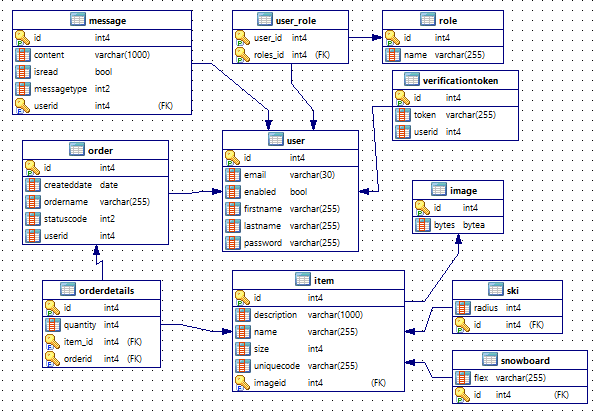

# SnowRental

Project implements ski and snowboard rental service in Spring MVC.
[See demos here](demo/)

### Registration process

1. User completes registration form.
2. Fields are validated, if error occurs user is informed.
3. Email is sent with confirmation link.
4. When confirmation link is clicked, user account is activated.

### Login process

1. User completes login form.
2. Fields are validated, if error occurs user is informed.
3. Custom UserDetailsService interface is used for automatic authentication (from Spring Security).
4. If authentication is successful user is redirected to proper page, if not user is informed that passed invalid credentials or account is not activated.

### 

### Information

* Spring Security
* Password encoding (BCryptPasswordEncoder)
* Using Java configuration (annotations)
* Using JPA repository
* Confirm registration (email verification) - unique, randomly generated token
* Google reCAPTCHA which protects website from spam and bots
* I18N

End with an example of getting some data out of the system or using it for a little demo

## Deployment

Deploy on Apache Tomcat 8.0+

## Tools and frameworks

* [Java](http://www.oracle.com/technetwork/java/javase/downloads/jdk8-downloads-2133151.html) - Java Development Kit 8
* [Maven](https://maven.apache.org/) - Dependency Management
* [Spring framework](https://spring.io/) - Spring Framework 5.0.4
* [Spring Security](https://projects.spring.io/spring-security/) - Spring Security 5.0.3
* [Hibernate](http://hibernate.org/orm/documentation/5.0/) - Hibernate 5.2.12.Final
* [PostgreSQL](https://www.postgresql.org/) - PostgreSQL 10
* [Thymeleaf](https://www.thymeleaf.org) - Thymeleaf 3.0 framework
* [Bootstrap](https://getbootstrap.com/) - Bootstrap 4.0 framework
* [Javax mail](https://mvnrepository.com/artifact/javax.mail) - JavaMail API provides classes that model a mail system.
* [Jackson](https://github.com/FasterXML/jackson) - JSON library for Java
* [Guava](https://github.com/google/guava) - Google Core Libraries for Java
* [X-editable](https://vitalets.github.io/x-editable/docs.html) - X-editable in-place editing 
* [ITextPdf](https://itextpdf.com/) - PDF Generator

### Settings

## Database scheme



## Properties

Need to be under 'src\main\resources'

* **application.properties**

    ```
    google.recaptcha.key.url=https://www.google.com/recaptcha/api/siteverify
    google.recaptcha.key.site=site_key_here
    google.recaptcha.key.secret=secret_key_here
    ``` 
   
   
* **hibernate.properties**

	```
	dataSource.driverClassName=org.postgresql.Driver
	dataSource.url=jdbc:postgresql://localhost:5555/DBNAME?characterEncoding=utf-8
	dataSource.username=DATABASE_USER
	dataSource.password=DATABASE_PASSWORD

	hibernate.dialect=org.hibernate.dialect.PostgreSQLDialect
	hibernate.default_schema=public
	hibernate.hbm2ddl.auto=update
	hibernate.show_sql=true
	```
	
* **email.properties**

    ```
	support.email=snowrentalspring@gmail.com
	mail.host=smtp.gmail.com
	mail.port=587
	mail.protocol=smtp
	mail.username=GMAIL_ACCOUNT_USERNAME
	mail.password=GMAIL_ACCOUNT_PASSWORD
	```

## Useful links

* [baeldung.com](http://www.baeldung.com/registration-verify-user-by-email) - Registration - verify user by email
* [memorynotfound.com](https://memorynotfound.com/integrate-google-recaptcha-spring-web-application-java/) - ReCAPTCHA in Spring app
* [nixmash.com](https://nixmash.com/post/bootstrap-navbar-highlighting-in-thymeleaf) - Bootstrap navbar highlighting
* [thoughts-on-java.org](https://www.thoughts-on-java.org/complete-guide-inheritance-strategies-jpa-hibernate/) - Inheritance in Hibernate
* [vladmihalcea.com](https://vladmihalcea.com/a-beginners-guide-to-jpa-and-hibernate-cascade-types/) - Hibernate cascade types
* [meri-stuff.blogspot.com](http://meri-stuff.blogspot.com/2012/03/jpa-tutorial.html#RelationshipsBidirectionalOneToManyManyToOneConsistency) - JPA relations tutorial


## License

This project is licensed under the MIT License - see the [LICENSE.md](LICENSE.md) file for details
